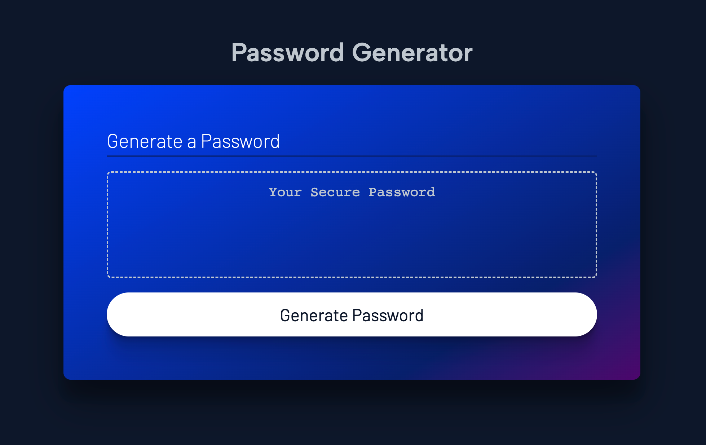

# JavaScript: Password Generator
## Description
Bootcamp week 3 Javascript challenge where we create a password generator. The user must choose a password length between 8 and 128 characters. The user can to include lowercase, uppercase, numeric, and/or special characters. At least one character type must be selected.
## Installation
N/A
## Usage
Open [this website](https://skywalkah.github.io/password-generator/) in Chrome and follow the prompts to generate a secure password. Open Developer tools to look for errors.
## What it should look like

## Credits
N/A

## License
MIT license - Please refer to the LICENSE in the repo for more info.